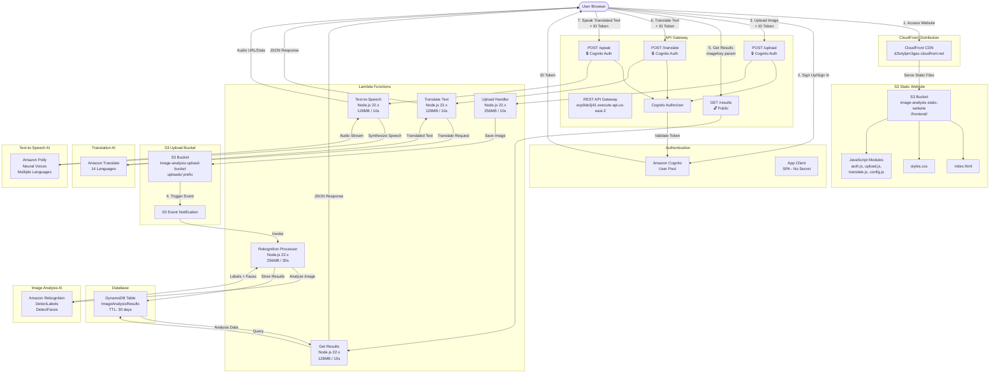

# AWS Image Analysis Application - Architecture Diagram

## Complete Architecture Flow

```mermaid
flowchart TB
    User([User Browser])

    subgraph CDN["CloudFront Distribution"]
        CF[CloudFront CDN<br/>d2tvtylprn3gax.cloudfront.net]
    end

    subgraph Storage["S3 Static Website"]
        S3Static[S3 Bucket<br/>image-analysis-static-website<br/>/frontend/]
        HTML[index.html]
        CSS[styles.css]
        JS[JavaScript Modules<br/>auth.js, upload.js,<br/>translate.js, config.js]
    end

    subgraph Auth["Authentication"]
        Cognito[Amazon Cognito<br/>User Pool]
        CognitoClient[App Client<br/>SPA - No Secret]
    end

    subgraph API["API Gateway"]
        APIGW[REST API Gateway<br/>ecp0de3j41.execute-api.us-east-2]
        UploadEndpoint[POST /upload<br/>🔒 Cognito Auth]
        ResultsEndpoint[GET /results<br/>🔓 Public]
        TranslateEndpoint[POST /translate<br/>🔒 Cognito Auth]
        PollyEndpoint[POST /speak<br/>🔒 Cognito Auth]
        CognitoAuth[Cognito Authorizer]
    end

    subgraph Compute["Lambda Functions"]
        UploadLambda[Upload Handler<br/>Node.js 22.x<br/>256MB / 10s]
        RekogLambda[Rekognition Processor<br/>Node.js 22.x<br/>256MB / 30s]
        ResultsLambda[Get Results<br/>Node.js 22.x<br/>128MB / 10s]
        TranslateLambda[Translate Text<br/>Node.js 22.x<br/>128MB / 10s]
        PollyLambda[Text-to-Speech<br/>Node.js 22.x<br/>128MB / 10s]
    end

    subgraph ImageStorage["S3 Upload Bucket"]
        S3Upload[S3 Bucket<br/>image-analysis-upload-bucket<br/>uploads/ prefix]
        S3Event[S3 Event Notification]
    end

    subgraph Database["Database"]
        DynamoDB[DynamoDB Table<br/>ImageAnalysisResults<br/>TTL: 30 days]
    end

    subgraph ImageAI["Image Analysis AI"]
        Rekognition[Amazon Rekognition<br/>DetectLabels<br/>DetectFaces]
    end

    subgraph TranslationAI["Translation AI"]
        Translate[Amazon Translate<br/>14 Languages]
    end

    subgraph TextToSpeechAI["Text-to-Speech AI"]
        Polly[Amazon Polly<br/>Neural Voices<br/>Multiple Languages]
    end

    %% User Flow
    User -->|1. Access Website| CF
    CF -->|Serve Static Files| S3Static
    S3Static --> HTML
    S3Static --> CSS
    S3Static --> JS

    %% Authentication Flow
    User -->|2. Sign Up/Sign In| Cognito
    Cognito -->|ID Token| User

    %% Image Upload Flow
    User -->|3. Upload Image<br/>+ ID Token| UploadEndpoint
    UploadEndpoint --> CognitoAuth
    CognitoAuth -->|Validate Token| Cognito
    UploadEndpoint --> UploadLambda
    UploadLambda -->|Save Image| S3Upload
    S3Upload -->|4. Trigger Event| S3Event
    S3Event -->|Invoke| RekogLambda
    RekogLambda -->|Analyze Image| Rekognition
    Rekognition -->|Labels + Faces| RekogLambda
    RekogLambda -->|Store Results| DynamoDB

    %% Results Retrieval Flow
    User -->|5. Get Results<br/>imageKey param| ResultsEndpoint
    ResultsEndpoint --> ResultsLambda
    ResultsLambda -->|Query| DynamoDB
    DynamoDB -->|Analysis Data| ResultsLambda
    ResultsLambda -->|JSON Response| User

    %% Translation Flow
    User -->|6. Translate Text<br/>+ ID Token| TranslateEndpoint
    TranslateEndpoint --> CognitoAuth
    TranslateEndpoint --> TranslateLambda
    TranslateLambda -->|Translate Request| Translate
    Translate -->|Translated Text| TranslateLambda
    TranslateLambda -->|JSON Response| User

    %% Text-to-Speech Flow
    User -->|7. Speak Translated Text<br/>+ ID Token| PollyEndpoint
    PollyEndpoint --> CognitoAuth
    PollyEndpoint --> PollyLambda
    PollyLambda -->|Synthesize Speech| Polly
    Polly -->|Audio Stream| PollyLambda
    PollyLambda -->|Audio URL/Data| User

    class User userClass
    class CF cdnClass
    class S3Static,S3Upload s3Class
    class Cognito,CognitoClient,CognitoAuth authClass
    class APIGW,UploadEndpoint,ResultsEndpoint,TranslateEndpoint,PollyEndpoint apiClass
    class UploadLambda,RekogLambda,ResultsLambda,TranslateLambda,PollyLambda lambdaClass
    class Rekognition,Translate,Polly aiClass
    class DynamoDB dbClass
```